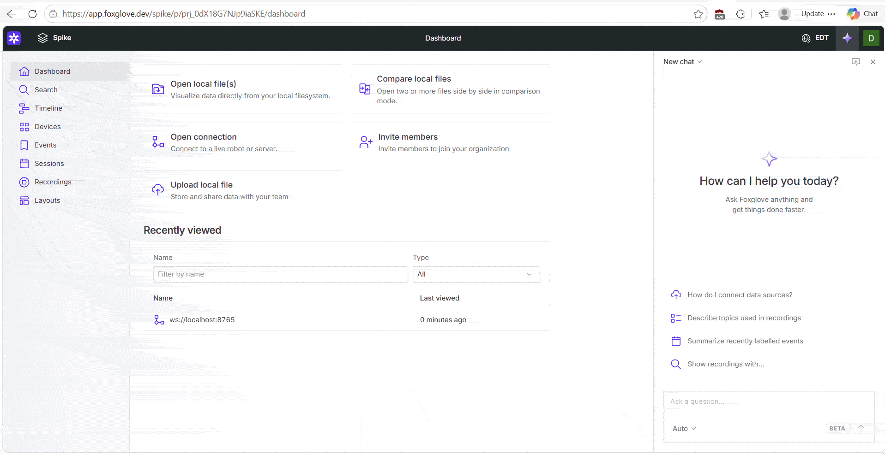
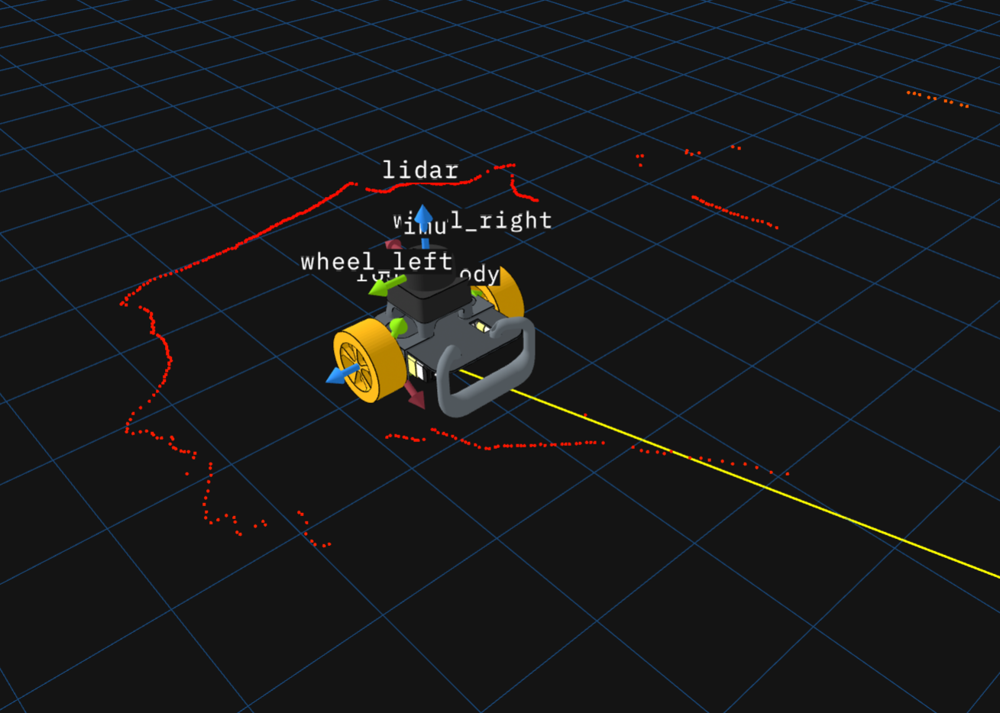
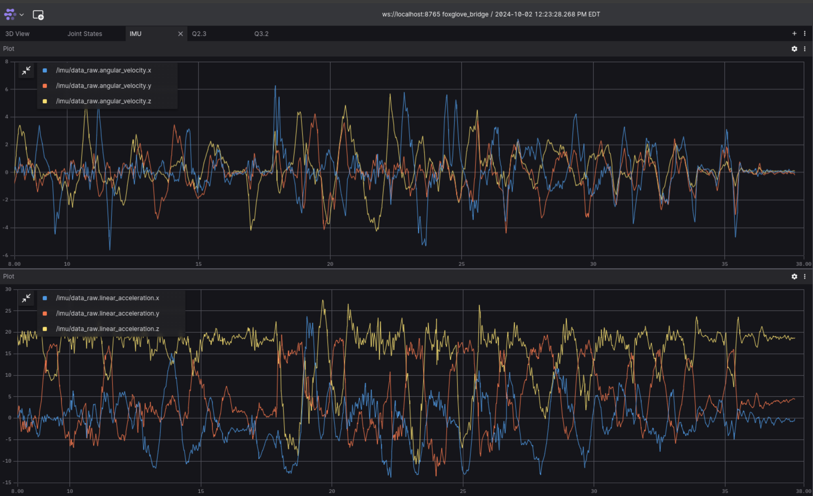
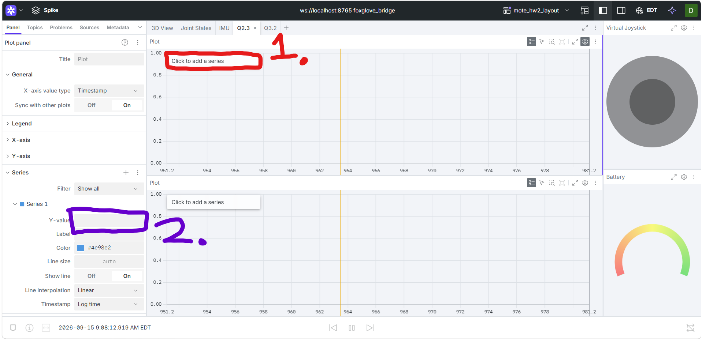

# HW 2: Kinematics and Odometry

## Summary

In this assignment, you will:

1. Characterize a kinematic model for Mote
2. Apply it to compute a position estimate for the rover

## Before you start

1. Apply the layout `mote_hw2_layout.json`, from the `foxglove` folder, in [Foxglove](https://app.foxglove.dev/) in the same way you did in HW1.
2. Drag and drop the file `yulong.virtual-joystick-0.0.2.foxe`, from the `foxglove` folder, into the Foxglove window.
  - This is a Foxglove extension that allows us to control the robot using a joystick.
  - With this done, the top right panel will show the joystick instead of saying "Unknown panel type". 



## Q0. Investigating Transforms in Foxglove (10 pts)

[TF](http://wiki.ros.org/tf) is a ROS package that we use to keep track of 3D coordinate frames.

Mote contains a number of such frames, and we can view them within Foxglove.

First, run a visualization node to view the robot:
```
roslaunch mote_demos simple_teleop_viz.launch
```

Then in Foxglove:
1. Click the gear in the top right of the 3D Panel, which will open its settings in a panel on the left.
2. Drop down the "transforms" section, and make each transform visible (click the closed eye on each transform). It should look something like this:



> **Q0.1:** In Foxglove, examine the robot and its transforms. The x axis for each frame is red, the y axis is green, and the z axis is blue.
> * In Foxglove, find the frame `base_link`. Relative to this frame, along which axis does the rover move forward?
> * Now, look at wheel frames (`wheel_left`, `wheel_right`). Rotation follows the right hand rule. What rotation direction (positive or negative) will each wheel rotate when the rover moves forward?

**Submission:** Put both answers under Q0.1 in [`writeup/writeup.md`](./writeup/writeup.md#q0-investigating-transforms-in-foxglove-10-pts).

<details>
<summary>Rubric (10 pts)</summary>

* **5 pts:** Correctly identifies the forward axis relative to `base_link`.
* **5 pts:** Correctly identifies the positive or negative rotation direction of both wheel joints.

</details>

## Q1. Identifying a Kinematic Model (20 pts)
Refer to the course notes on mobile robot kinematics, specifically differential drive steering.

Use the right-hand-rule convention from the notes: $x$ points forward, $y$ points to the robot's left, and a positive angular velocity $\omega$ is a counterclockwise (left) turn, produced by the right wheel running faster than the left.

> **Q1.1:** Given a target linear velocity $\upsilon$ and angular velocity $\omega$ for a differential drive robot with wheel separation $b$ (m), write an equation for the rover's linear wheel velocities $\upsilon_{l}$, $\upsilon_{r}$ (in m/s).
You may do this either by embedding LaTeX or taking a picture of your handwritten work (any illegible work will not be graded).

**Submission:** Put your equations and supporting work under Q1.1 in [`writeup/writeup.md`](./writeup/writeup.md#q1-identifying-a-kinematic-model-20-pts).

<details>
<summary>Rubric (5 pts)</summary>

* **5 pts:** Correct equations for both left and right linear wheel velocity, including the effect of wheel separation and turn direction.

</details>

> **Q1.2:** Given linear wheel velocities $\upsilon_{l}$, $\upsilon_{r}$ (m/s), write an equation for the resulting angular velocity of each wheel, $\dot{\phi_l}$ and $\dot{\phi_r}$ (rad/s), in terms of $\upsilon_{l}$, $\upsilon_{r}$, and wheel diameter $d$. Note that these are the wheels' spin rates, which are not the same quantity as the rover's turn rate $\omega$.

**Submission:** Put your equations and supporting work under Q1.2 in [`writeup/writeup.md`](./writeup/writeup.md#q1-identifying-a-kinematic-model-20-pts).

<details>
<summary>Rubric (5 pts)</summary>

* **5 pts:** Correctly converts both linear wheel velocities in m/s to angular wheel velocities in rad/s using the wheel radius.

</details>

> **Q1.3:** Given wheel velocities $\upsilon_{l}$, $\upsilon_{r}$ (m/s), write an equation for the resulting linear velocity $\upsilon$ (m/s) and angular velocity $\omega$ (rad/s) for a differential drive robot with wheel separation $b$ (m).

**Submission:** Put your equations and supporting work under Q1.3 in [`writeup/writeup.md`](./writeup/writeup.md#q1-identifying-a-kinematic-model-20-pts).

<details>
<summary>Rubric (10 pts)</summary>

* **5 pts:** Correct equation for the rover's linear velocity.
* **5 pts:** Correct equation for the rover's angular velocity, including wheel separation and sign convention.

</details>

## Q2. Inverse Kinematics (20 pts)

As part of its control loop, the rover uses inverse kinematics to calculate its wheel speeds. You'll compute your own IK solution and compare it to what the rover outputs.

> **Q2.1:** Follow the instructions in `hw2_pkg/hw2_pkg/inverse_kinematics.py` to implement the equations you identified in Q1.1 and Q1.2, then publish joint state messages with the contents.

Check your signs against Q0.1: both wheels spin in the positive direction when the rover drives forward, so the left and right wheel speeds have the same sign when driving straight. Only the $\omega$ term differs between them.

To test your node, run:

```
rostest hw2_pkg ik_tests.test
```

**Submission:** Submit your completed [`hw2_pkg/hw2_pkg/inverse_kinematics.py`](./hw2_pkg/hw2_pkg/inverse_kinematics.py) in the HW2 folder.

<details>
<summary>Rubric (10 pts)</summary>

10 points for passing `ik_tests.test`.

</details>

If your visualization node isn't already running, to view your graphs, run:
```
roslaunch mote_demos simple_teleop_viz.launch
```

In a separate terminal, run
```
rosrun hw2_pkg inverse_kinematics.py
```
to execute your node.

> **The provided Foxglove layout has a tab labeled Q2.2, set up with two plot panels.**

Using one plot panel for each wheel, plot:
* Your computed velocity on topic `/joint_states_predicted.velocity[0]` and `/joint_states_predicted.velocity[1]` (left and right respectively) vs 
* The ground truth velocity calculated by the wheel encoders on topic `/joint_states.velocity[0]` / `/joint_states.velocity[1]`.


Reference the other tabs "Joint States" and "IMU" for examples of how to plot in Foxglove.


> **Note: What are joint states?** &nbsp;&nbsp;&nbsp;&nbsp;&nbsp;&nbsp;&nbsp;&nbsp;&nbsp;&nbsp;&nbsp;&nbsp;&nbsp;&nbsp;&nbsp;&nbsp;&nbsp;&nbsp;&nbsp;&nbsp;&nbsp;&nbsp;&nbsp;&nbsp;&nbsp;&nbsp;&nbsp;&nbsp;&nbsp;&nbsp;&nbsp;&nbsp;&nbsp;&nbsp;&nbsp;&nbsp;&nbsp;&nbsp; (。_。)*?
>
> Joint states are a ROS message type that contains information about the position, velocity, and effort* of each joint in a robot. In this case, the rover's wheels are considered joints, and their velocities are being compared between your computed values and the actual values reported by the wheel encoders.
>
> ***effort** is a measure of how much power/force is being applied to the joint. 

Drive the rover around to collect data. Now you can use the joystick! The predicted velocity and the actual velocity should follow the same trends.

> **Note:** `/joint_states_predicted` is only published when a velocity command arrives, so the plot stays empty until you move the joystick. Plot the `velocity` field only; `position` and `effort` are intentionally left empty by your node.


> *Example of finished plot: IMU plot panel*

> **Q2.2:** Attach a screenshot of your plots zoomed in to show an interesting section. The plots must show predicted and measured velocities for both wheels.

<details>
<summary>Rubric (5 pts)</summary>

* **5 pts:** Plots clearly compare predicted and measured velocities for both the left and right wheels.

</details>
<br>

> **Q2.3:** Write about what you see in the graph you generated. Are your computed values far off from the actual value? What could account for those differences?

**Submission:** Put the written response under Q2.3 in [`writeup/writeup.md`](./writeup/writeup.md#q2-inverse-kinematics-20-pts).

<details>
<summary>Rubric (5 pts)</summary>

* **5 pts:** Written response accurately compares the signals and discusses reasonable causes of discrepancies.

</details>

> **Common Problems:**
><details>
><summary>Lost the plot?</summary>
> <br>
>Double click on the plot to reset the zoom and follow the currently publishing data. 
><br>
>If you don't see any data, first check the Topics panel on the left of Foxglove: a topic that is actually receiving messages shows a Hz rate next to its name, and `/joint_states_predicted` only shows one while you are driving. Then make sure your node is running and publishing to the correct topics. You can check this by running `rostopic list` in a terminal and looking for `/joint_states_predicted` and `/joint_states`. If you don't see these topics, make sure your inverse kinematics and visualization nodes are running.
> <br>
></details>
>
><details>
><summary>Can't figure out how to plot?</summary>
> <br>
>1. Click on the plot panel to select it.
> <br>
>2. Click on the "click to add a series" button in the top left of the plot panel.
> <br>
>3. In the "Add Series" dialog, select the topic you want to plot from the dropdown menu (in this case, `/joint_states_predicted.velocity[:]` and `joint_states.velocity[:]` ([or `[0]` or `[1]` if you want to select a specific wheel's velocity])).
>
> 
>
></details>
><br>


## Q3. Forward Kinematics (20 pts)

Now let's do forward kinematics.

> **Q3.1:** Follow the instructions in `hw2_pkg/hw2_pkg/forward_kinematics.py` to implement the equations you identified in Q1.3, then publish a TwistStamped message with the result. Compute the twist based on the actual wheel velocities as reported by the wheel encoders.

To test your node, run:
```
rostest hw2_pkg fk_tests.test
```

**Submission:** Submit your completed [`hw2_pkg/hw2_pkg/forward_kinematics.py`](./hw2_pkg/hw2_pkg/forward_kinematics.py) in the HW2 folder.

<details>
<summary>Rubric (10 pts)</summary>

10 points for passing `fk_tests.test`

</details>

If it's not already running, run your visualization using:
```
roslaunch mote_demos simple_teleop_viz.launch
```

In a separate terminal, run
```
rosrun hw2_pkg forward_kinematics.py
```

The provided Foxglove layout has a tab labeled Q3.2 with two plot panels provided. In one plot panel, plot the values:

* Linear velocity computed from actual wheel velocities (on topic `/cmd_vel_ground_truth.twist.linear.x`) vs 
* Commanded linear velocity (on topic `/diff_drive_controller/cmd_vel.linear.x`).

In a second, plot the values:

* Angular velocity computed from actual wheel velocities (on topic `/cmd_vel_ground_truth.twist.angular.z`) vs 
* Commanded angular velocity (on topic `/diff_drive_controller/cmd_vel.angular.z`).

Drive the rover around to collect data.


> **Q3.2:** Attach a screenshot of your plots zoomed in to show an interesting section and write about what you see in the graph.
> * How do the commanded and actual velocities compare?
> * What could account for those differences?

**Submission:** Put the plot screenshot and written response under Q3.2 in [`writeup/writeup.md`](./writeup/writeup.md#q3-forward-kinematics-20-pts). Include both the linear-velocity and angular-velocity comparisons.

<details>
<summary>Rubric (10 pts)</summary>

* **5 pts:** Plots clearly compare commanded and calculated linear and angular velocities over an informative interval.
* **5 pts:** Written response accurately compares the signals and discusses reasonable causes of discrepancies.

</details>

## Q4. Calculating an Odometry Solution (30 pts)

Now that we've calculated the actual velocity of the rover, we'll integrate these velocities to estimate the robot's trajectory.
To understand what's happening here, it may be useful to skim the ROS conventions for [Coordinate Frames for Mobile Platforms](https://www.ros.org/reps/rep-0105.html).

> **Q4.1:** In `hw2_pkg/hw2_pkg/odometry.py` integrate the Twist messages for a single timestep and publish an Odometry message.

Remember, we have a current position, linear and angular velocity, and we want to integrate these to get our next position and orientation. For this, we use the time between measurements to be $dt$. For this assignment, you can assume that the rover is moving at a constant velocity. **However, you cannot assume that the rover is moving in a straight line.** The rover may be turning, so you will need to account for this in your integration.

Use **midpoint integration** for this step: advance the yaw by $\omega \, dt$, and advance the position along the heading taken at the middle of the step, $\theta + \omega \, dt / 2$. This is the method the tests expect. It approximates the exact constant-velocity arc, is accurate at the small time steps between encoder updates, and avoids the division by $\omega$ that the exact arc requires.

To test your node, run:
```
rostest hw2_pkg odom_tests.test
```
You should pass all tests that don't include "transform".

**Submission:** Submit your completed [`hw2_pkg/hw2_pkg/odometry.py`](./hw2_pkg/hw2_pkg/odometry.py) in the HW2 folder.

<details>
<summary>Rubric (20 pts)</summary>

20 points for passing the 4 non-transform tests in `odom_tests.test`

</details>

> **Q4.2:** Also in `hw2_pkg/hw2_pkg/odometry.py`, use the odometry information to publish a transform between `odom` (parent frame) and `base_link` (child frame).

To test your node, run:
```
rostest hw2_pkg odom_tests.test
```

**Submission:** Include the transform broadcaster implementation in [`hw2_pkg/hw2_pkg/odometry.py`](./hw2_pkg/hw2_pkg/odometry.py).

<details>
<summary>Rubric (5 pts)</summary>

* **5 pts:** Passes `test_transform` by broadcasting the calculated pose from parent frame `odom` to child frame `base_link`.

</details>

> **Note: What's Happening Here?**
> 
> We are publishing a transform between the `odom` frame and the `base_link` frame. The `odom` frame is a fixed frame that represents the starting position of the robot, while the `base_link` frame is attached to the robot and moves with it. By publishing this transform, we can visualize the robot's movement in Foxglove and other ROS tools.

> **Q4.3:**  If it's not already running, run visualization using:
```
roslaunch mote_demos simple_teleop_viz.launch
```

Then disable the transform published by the built-in differential-drive controller:
```
rosrun dynamic_reconfigure dynparam set /diff_drive_controller enable_odom_tf false
```

> **Note: What's Happening Here?**
>
> The differential-drive controller normally publishes its own transform from `odom` to `base_link`. Your `odometry.py` node also publishes this transform as part of Q4.2. If both nodes publish the same transform, Foxglove receives two different estimates for the position of `base_link` and the robot may appear to jump back and forth between them. This command disables the controller's transform so that your odometry node is the only publisher of `odom` to `base_link`. Run the command again whenever you restart the visualization launch file.

In a separate terminal, run
```
rosrun hw2_pkg forward_kinematics.py
```

In a third terminal, run
```
rosrun hw2_pkg odometry.py
```

> **Note:** Your odometry node accumulates pose from the moment it starts. Restart `odometry.py` right before the experiments below so the rover starts at the origin of `odom`, and restart it again between experiments if you want a clean comparison.

In Foxglove, open the 3D panel's settings. Expand the frame drop down, set the display frame to `odom` and the follow mode to pose.
Drive the rover around and you should see it moving relative to the `odom` frame!

To qualitatively measure the performance of your odometry, let's run some experiments. In each of the following situations, teleoperate the rover and see how the odometry updates.
1. Hold the rover with its wheels in the air.
2. Stop one of the wheels with your hand.
3. Run the rover into a wall.

How does the odometry handle these contingencies? What other capabilities of the rover could we integrate to address these shortfalls?

**Submission:** Put your observations and proposed improvements under Q4.3 in [`writeup/writeup.md`](./writeup/writeup.md#q4-calculating-an-odometry-solution-30-pts). Address all three experiments.

<details>
<summary>Rubric (5 pts)</summary>

* **3 pts:** Clearly describes the observed odometry behavior in all three experiments.
* **2 pts:** Proposes reasonable rover sensors or capabilities that could reduce the identified odometry errors.

</details>

## Deliverables

1. **(10 pts)** Q0.1 transform-frame answers in `writeup/writeup.md`.
2. **(20 pts)** Q1.1–Q1.3 kinematic equations and supporting work in `writeup/writeup.md`.
3. **(10 pts)** Completed inverse-kinematics publisher passing `ik_tests.test`.
4. **(5 pts)** Q2.2 inverse-kinematics plots
5. **(5 pts)** Q2.3 analysis in `writeup/writeup.md`.
6. **(10 pts)** Completed forward-kinematics publisher passing `fk_tests.test`.
7. **(10 pts)** Q3.2 forward-kinematics plots and analysis in `writeup/writeup.md`.
8. **(20 pts)** Completed odometry integration passing the non-transform tests in `odom_tests.test`.
9. **(5 pts)** Completed `odom` to `base_link` transform passing `test_transform`.
10. **(5 pts)** Q4.3 odometry experiments and analysis in `writeup/writeup.md`.
11. **(0 pts)** Completed `writeup/writeup.md` time spent and feedback.

## Submission

Submit one ZIP file containing the complete `hw2` folder to Gradescope. The `hw2` folder must be the wrapper folder in the ZIP; do not submit only its contents.

From the directory containing `hw2`, create the submission with:

```bash
cd /catkin_ws/src/mote_curriculum
zip -r hw2.zip hw2/
```

Before submitting, inspect the archive and confirm that it begins with the `hw2/` directory:

```bash
unzip -l hw2.zip
```

Submit once per group, and add your group members to the submission on Gradescope so everyone receives the grade.

Good job!                ( ╹ڡ╹)つ Bye
