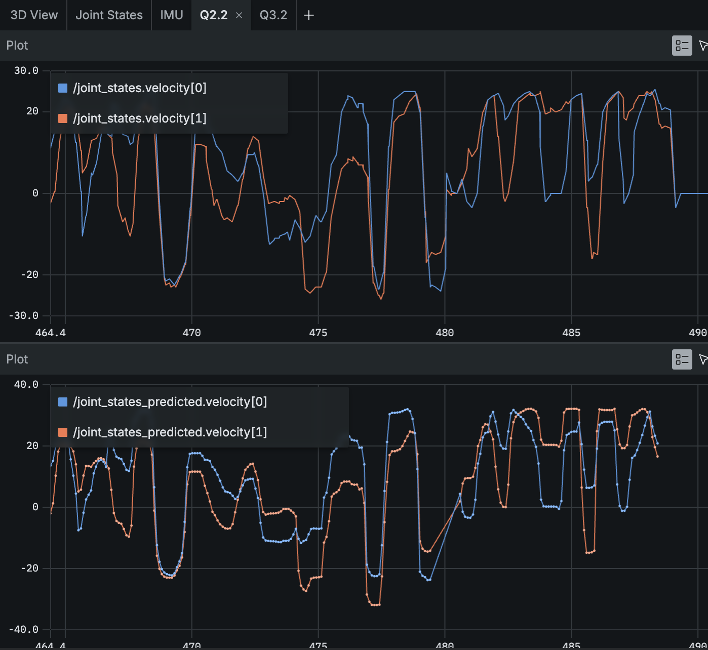
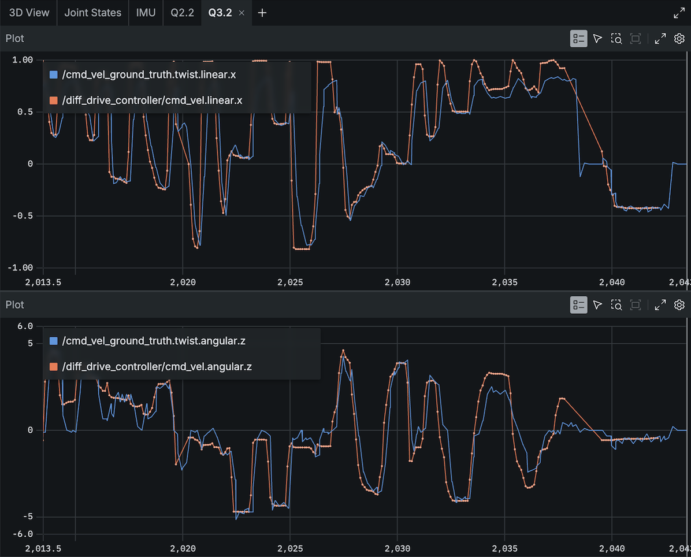

<!---
If you're new to markdown, check out this reference: https://www.markdownguide.org/basic-syntax/
-->

# Writeup

## Q0. Investigating Transforms in Foxglove (10 pts)

**Q0.1:**

- Forward axis of `base_link`: $+x$ (red axis).
- `wheel_left`: positive rotation when driving forward.
- `wheel_right`: positive rotation when driving forward.

**Verification:** With the joystick, turning right gave positive
`/joint_states.velocity[0]` (left) and negative
`/joint_states.velocity[1]` (right). Therefore, driving forward
gives positive velocity on both wheels.

## Q1. Identifying a Kinematic Model (20 pts)

**Q1.1:** 

<!---
You can use LaTeX syntax like so: $a_{example} = b_{example} + c_{example}$.
You can use $\upsilon$ for linear velocity and $\omega$ for angular velocity.

If you prefer to write out your work, you can include it in an image as follows:

-->
Given target linear velocity $\upsilon$ (m/s), angular velocity $\omega$ (rad/s), and wheel separation $b$ (m).

From lecture, we have

$$
\upsilon = \frac{\upsilon_r + \upsilon_l}{2}.
$$

Suppose the robot is turning with $r$ being the distance from the body frame to the instantaneous center of robot rotation. For a counterclockwise turn, the left wheel follows a radius of curvature of $r - \frac{b}{2}$ and the right wheel follows a radius of curvature of $r + \frac{b}{2}$.

Then,

$$
\upsilon_l = \omega\left(r - \frac{b}{2}\right)
\qquad
\upsilon_r = \omega\left(r + \frac{b}{2}\right).
$$

Then,

$$
\frac{\upsilon_l}{\omega} + \frac{b}{2}
=
\frac{\upsilon_r}{\omega} - \frac{b}{2}
\qquad \Rightarrow \qquad
\omega = \frac{\upsilon_r - \upsilon_l}{b}.
$$

Then,

$$
\frac{\omega}{\upsilon}
=
\frac{2(\upsilon_r - \upsilon_l)}
{(\upsilon_r + \upsilon_l)b}.
$$

So,

$$
\upsilon_l = \upsilon - \frac{b\omega}{2}
\qquad
\upsilon_r = \upsilon + \frac{b\omega}{2}.
$$

**Q1.2:**

We know that $\upsilon = r\dot{\phi}$ and $r = \frac{d}{2}$.

Given $\upsilon_l$ and $\upsilon_r$,

$$
\upsilon_l = r\dot{\phi}_l
\qquad
\upsilon_r = r\dot{\phi}_r.
$$

Solving for $\dot{\phi}_l$ and $\dot{\phi}_r$, we get

$$
\dot{\phi}_l = \frac{\upsilon_l}{r}
\qquad
\dot{\phi}_r = \frac{\upsilon_r}{r}.
$$

Since $r = \frac{d}{2}$,

$$
\dot{\phi}_l = \frac{2\upsilon_l}{d}
\qquad
\dot{\phi}_r = \frac{2\upsilon_r}{d}.
$$

**Q1.3:**

From Q1.1, we have

$$
\upsilon_l = \upsilon - \frac{b\omega}{2}
\qquad
\upsilon_r = \upsilon + \frac{b\omega}{2}.
$$

Adding the two equations,

$$
\upsilon_l + \upsilon_r = 2\upsilon
$$

so

$$
\upsilon = \frac{\upsilon_r + \upsilon_l}{2}.
$$

Subtracting the left wheel velocity from the right wheel velocity,

$$
\upsilon_r - \upsilon_l = b\omega
$$

so

$$
\omega = \frac{\upsilon_r - \upsilon_l}{b}.
$$

Here, $b$ is the wheel separation. This follows the sign convention that a left turn has $\upsilon_r > \upsilon_l$, giving $\omega > 0$, while a right turn has $\upsilon_r < \upsilon_l$, giving $\omega < 0$.

## Q2. Inverse Kinematics (20 pts)

**Q2.2:** 

**Q2.3:** 

The predicted wheel velocities are very similar to the predicted/calculated values. The remaining differences are most noticeable around rapid changes in velocity and at some of the peaks. This could be caused by friction and that real wheel velocity cannot change instantaneously and may lag slightly behind the commanded value.

## Q3. Forward Kinematics (20 pts)

**Q3.2:** 

The commanded and actual linear and angular velocities match fairly closely overall. The actual velocity follows the same general trend as the commanded velocity, including changes in direction and turning rate. However, around rapid changes in the command, the actual velocity sometimes lags slightly behind or does not reach exactly the same value. These differences can be caused by friction, slip, and that the commanded velocity can change immediately, while the robot has finite acceleration and cannot instantaneously change its motion.

## Q4. Calculating an Odometry Solution (30 pts)

**Q4.3:** 

Q4.3:
Observations:
1. When the robot wheels are both in the air, the actual robot is not moving forward, but in the simulation, it still shows the robot moving forward. Since the odometry assumes that wheel rotation corresponds to motion along the ground, it cannot tell that the wheels are spinning without actually translating the robot.
2. When holding a wheel down, and the joystick input is having the robot move forward, the simulation shows the robot rotating in place, presumably because the robot provides feedback on the left and right wheel's state. So, even though both wheels should have a positive linear velocity, the wheel being held down cannot move, so only one wheel has a substantial nonzero velocity. Since the rover's angular velocity depends on the difference between the left and right wheel velocities, the odometry interprets this difference as the robot turning. If we weren't holding the robot in the air and only one of the wheels actually moved, the robot would be spinning.
3. When driving into the wall, the wheels are still spinning, so the simulation reflects the robot moving forward even with a wall in front. This causes the estimated position to continue changing even though the rover's actual position is fixed.
Overall, these experiments show that the odometry depends on the wheel velocities and assumes that the wheel motion accurately represents the rover's actual motion. This assumption can break when the wheels are off the ground, hit's an obstacle, or slipping.

Improvement:
Add an accelerometer, since the current odometry depends on the two wheels' velocities only. Adding an accelerometer would provide additional information that helps the robot understand whether the robot is moving as expected or is actually stopped. We could also use a gyroscope to independently measure the rover's rotation. Combining this IMU data with the wheel odometry could help reduce errors when the wheel motion does not match the rover's actual motion.

## Feedback

**How much time did you spend on this assignment?** 

3.5 hours

**Do you have any feedback for this assignment?**

Please set this up as a github. Had many problems with three people working on it together but docker wouldn't open in a cloned github so we had to copy paste, push, pull, copy paste back, and then run tests.